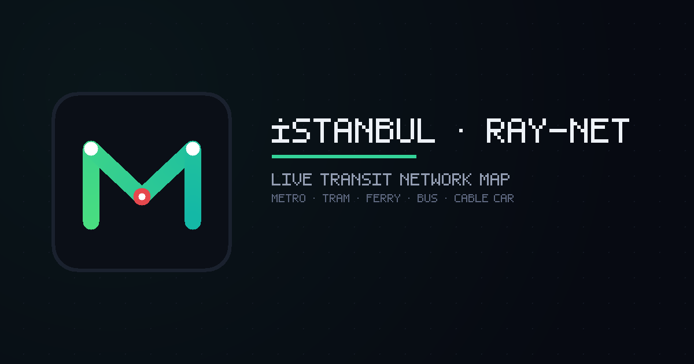

<p align="center">
  
</p>

<h1 align="center">İstanbul Ray-Net — Live Transit Network Map</h1>

<p align="center">
  
</p>

An interactive map of Istanbul's transit network (metro, Marmaray, trams, funiculars,
cable cars, Metrobüs, ferries and buses) on a real dark basemap, with animated "live"
carriages, official exact timetables, multimodal + multi-stop trip planning, live
auto-updating disruptions, per-district weather, and a Vision & Expansion tab showing
official future projects. Bilingual (EN/TR).

**Live site:** https://hero4mohamed.github.io/Metro-Istanbul-General-City-Map/

## 📲 Install as an app (PWA)
Open the live site on your phone and install it — it gets its own icon, full-screen
mobile UI (bottom navigation + slide-up sheets) and **auto-updates on every deploy**:
- **Android (Chrome/Edge):** tap the **Install app** button in the ◈ Layers sheet
  (or the browser's "Install app / Add to Home screen" menu).
- **iPhone (Safari):** Share → **Add to Home Screen**.

It's a single self-contained file — open [`index.html`](index.html) in any modern
browser (it needs internet for the map tiles, the Leaflet library, and on-demand
bus-route lookups).

## Features
- Real OpenStreetMap-derived geometry for every operational line.
- Animated carriages with station dwell + predictive arrivals.
- Trip planner (Dijkstra over the whole network) with refresh-safe history & favourites.
- **Tabs:** Active Network · Vision & Expansion (official + İBB projects, dashed) · Bus Directory (855 İETT lines, click to draw the real route).
- Light/Dark/Satellite basemaps, zoom-responsive line thickness, station service hours.

## How it's built
The map is generated from data in [`transit_data/`](transit_data/):

| script | input | output |
|---|---|---|
| `process.cjs` | `network.json` (Overpass) | `lines.json` (active lines) |
| `process-ferry.cjs` | `ferry.json`, `piers.json` | `ferry-lines.json` |
| `process-planned.cjs` | `planned.json` | `planned-lines.json` |
| `process-bus.cjs` | `bus-probe.json` | `bus-directory.json` |
| `build.cjs` | the JSONs + `app.template.html` | **`index.html`** |

`planned-manual.json` holds the hand-placed (approximate) future lines.

### To rebuild after editing the template or data
```bash
cd transit_data
node build.cjs            # regenerates ../index.html
```

### To refresh the source data from OpenStreetMap
The raw Overpass dumps are not committed (large, regenerable). Re-fetch with the
`.overpassql` query files, e.g.:
```bash
curl -s -A "rail-map/1.0" --data-urlencode "data@geom.overpassql" \
  https://overpass-api.de/api/interpreter -o network.json
node process.cjs && node build.cjs
```

## Data sources
OpenStreetMap (geometry & stops), Metro İstanbul project pages (future lines),
İETT (bus directory). Future-line alignments are approximate.
